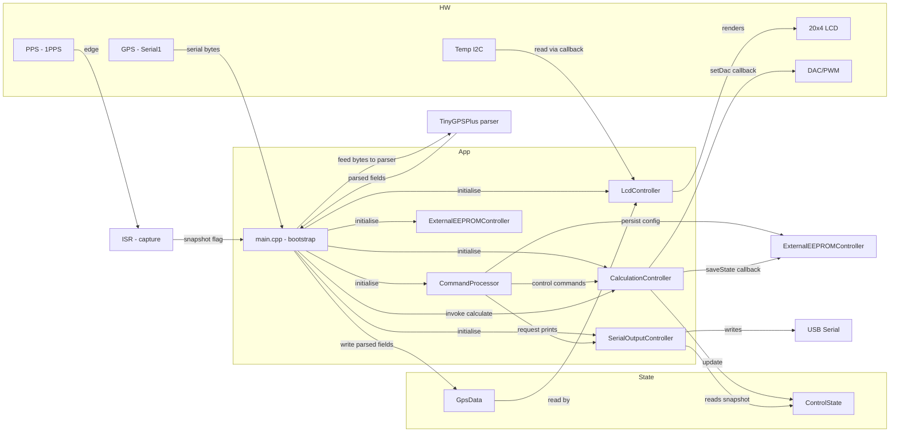
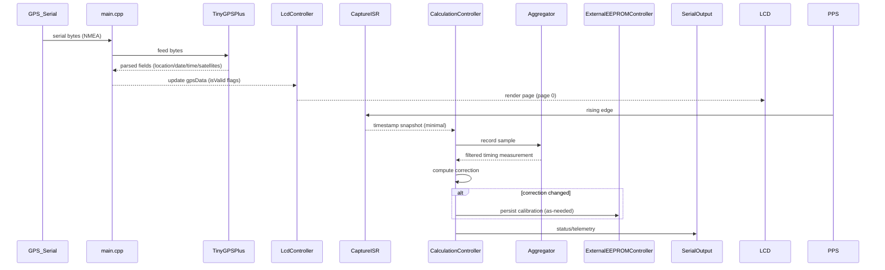
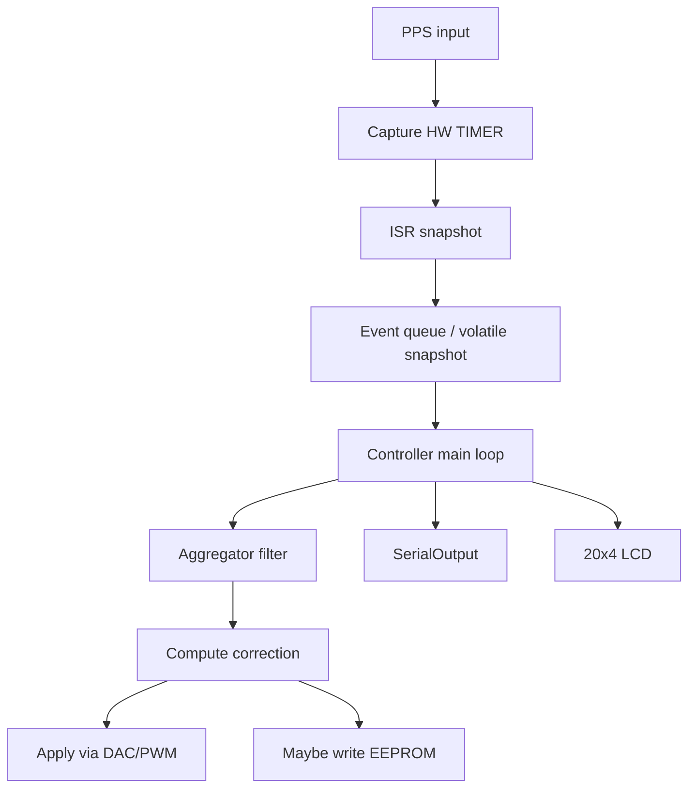

# GPSDO Firmware — Architecture

Purpose
-------
This document describes the architecture of the GPS Disciplined Oscillator (GPSDO) firmware in this repository. It
explains the high-level purpose, the main modules, how they interact, and the timing/interrupt behaviour that drives the
control loop. It includes mermaid diagrams to help visualize components and message/ISR sequences.

High-level summary
------------------

- Purpose: Discipline a local oscillator using GPS 1PPS (one pulse per second) input and maintain a stable output
  frequency.
- Target: ATmega4808 microcontroller (migration from ATmega328p original implementation).
- Key concerns: accurate timing/1PPS capture, low-latency ISR handling, persistence of calibration/state to EEPROM, and
  serial output for diagnostics.

Architecture overview
---------------------
The firmware is organised into small, focused modules:

- HAL (Hardware Abstraction Layer): small set of helper functions for pin/timer/ADC/DAC/EEPROM operations (keeps
  hardware differences centralised).
- CalculationController: the main control logic that updates frequency corrections based on measured PPS timing and
  aggregates measurements.
- Aggregator: short-term accumulators and filtering for timing samples used by the controller.
- Persistence / EEPROMController: read/write persistent calibration and configuration values; provides named addresses
  instead of magic numbers.
- CommandProcessor: handles commands received over the serial console and exposes configuration/control points.
- SerialOutputController: formats diagnostic and status messages over serial.
- LcdController: handles the 20×4 LCD, page rendering, and formatting. The controller receives GPS and temperature data
  via callbacks and reads the `GpsData` struct (in `src/Constants.h`) to decide whether to show values or placeholders.
- main.cpp: initialises hardware, wires up modules, and runs the main loop.

Files (mapping)
----------------

- `src/main.cpp` — system initialisation, main loop, and module wiring.
- `src/CalculationController.cpp` / `src/CalculationController.h` — control loop, correction computation, public API
  used by ISR or main loop.
- `src/SerialOutputController.cpp` / `src/SerialOutputController.h` — diagnostic/telemetry output.
- `src/CommandProcessor.cpp` / `src/CommandProcessor.h` — CLI parsing and command dispatch.
- `src/Callbacks.h` — ISR prototypes and callback signatures.
- `src/Constants.h` — header containing enums, compile-time constants, callback function typedefs, and structs used
  across modules for wiring and default runtime parameters.
- `archive/OriginalCode.cpp` — canonical reference implementation (read-only, do not edit).
- `src/LcdController.cpp` / `src/LcdController.h` — handles the 20×4 LCD, page rendering, and formatting. The controller
  receives GPS and temperature data via callbacks and reads the `GpsData` struct (in `src/Constants.h`) to decide
  whether to show values or placeholders.
- `src/ExternalEEPROMController.cpp` / `src/ExternalEEPROMController.h` — external I2C EEPROM controller (banked,
  wear-leveling, and atomic header/payload writes).

GPS handling
---------------------

- GPS parsing is performed in `main.cpp` using the TinyGPSPlus library; parsed values are written into the
  `LcdController::gpsData()` view of the shared `GpsData` structure. Parsing code sets the per-block validity flags when
  an updated, valid value is available (for example, `gps.location.isValid()` sets `isPositionValid`).

LCD behaviour summary
---------------------

- The `LcdController` exposes a simple page API; `main.cpp` or user input can change the current page. Page 0 is the
  primary telemetry view (latitude/longitude in DMS, date/time, temperatures, satellite count). The controller formats
  latitude/longitude as DMS (degrees° minutes' seconds.t) and prints hemisphere letters (N/S/E/W). If any data block is
  marked invalid (`is*Valid == false`) the controller shows a concise placeholder for that block so the UI remains
  stable.

Component diagram (mermaid)
---------------------------

Legend

- Arrows show direction of data/control flow. Labels are intentionally short and parser-safe. See text for exact
  semantics.

Arrow style mapping (for human readers)

- `-->` (solid) : standard data/control flow (writes, commands).
- `-.->` (dashed) : notification, event, or asynchronous signal (e.g., ISR snapshot to main).
- `==>` (thick arrow) : callback wiring or configured function pointers (main wires callbacks, Calc invokes them).
- `-.|>` (dotted with arrow) : read/poll semantics (a component reads/pulls snapshots from shared state).

Examples (human-readable, not additional mermaid)

- Command issued by `CommandProcessor` to `CalculationController`:
    - `Cmd --> Calc` (a solid arrow: direct command)
- ISR notifies main via a flag (async):
    - `PPS -.-> ISR_TCB0 -.-> Main` (dashed arrows: notification)
- Controller invoking a callback wired by main (e.g., setDac):
    - `Calc ==> setDac_callback ==> DAC` (thick arrows: callback invocation)
- SerialOutput reading a snapshot (pull):
    - `SerialOut -.|> ControlState` (dotted read-style)

Note: the diagram in this document omits inline arrow labels to stay compatible with the JetBrains Mermaid plugin. The
mapping above documents the intended semantics and visual mapping. If you want the diagram to use these arrow styles
directly, I can update the mermaid block to use them (I'll keep labels out of arrow text to avoid parser issues).

Key runtime flows
-----------------

1) Startup

- `main.cpp` performs hardware setup (timers, ADC, pin directions), reads persistent state from EEPROM via
  `ExternalEEPROMController`, and initialises the `CalculationController` with persisted calibration.
- Serial output is initialised for diagnostics; the command processor is attached to the serial input.

2) 1PPS capture and ISR

- The 1PPS input is captured using a pin change or timer input capture attached to an ISR (see `Callbacks.h`).
- ISR responsibilities MUST be minimal: capture timestamp or counter snapshot, increment counters if necessary, and push
  a small event or flag into a lock-free buffer or volatile snapshot structure consumed by the main context.
- Any shared variables updated by an ISR should be protected with atomic operations or `ATOMIC_BLOCK` equivalents when
  accessed from the main thread.

Sequence diagram (GPS + PPS -> processing & display)
----------------------------------------

Data model and important types
------------------------------
Use fixed-width integer types across modules for portability and explicitness. Examples:

- timestamp: uint32_t (or uint64_t if using very long counters)
- sample counters: uint32_t
- correction / accumulator: int32_t / int64_t when larger accumulation required

Contract (brief)
-----------------

- Inputs: 1PPS timestamp events, configuration from EEPROM, user commands from serial.
- Outputs: DAC/PWM adjustments (to discipline oscillator), serial diagnostics, persistent calibration to EEPROM.
- Error modes: missed PPS pulses, noisy measurements, EEPROM wear — these are signalled on serial and handled by
  conservative controller fallback logic.

Timing and ISR constraints
-------------------------

- Keep ISRs small: snapshot hardware counters and set an atomic flag. Defer heavier processing to the controller running
  in main.
- Use hardware capture/timers where possible to reduce software jitter.
- Use ATOMIC_BLOCK or equivalent when reading multi-byte values modified in ISR.

Persistence and EEPROM
----------------------

- The project now uses an external I2C EEPROM managed by `ExternalEEPROMController` (banked layout, header + payload
  scheme). `ExternalEEPROMController` to load/save full `ControlState` and `LongTermControlState`.
- The legacy `EEPROMController` (internal MCU EEPROM helper) remains in the tree for reference but the active
  persistence implementation in this port is `ExternalEEPROMController`.
- Documented EEPROM layout lives in `docs/external-eeprom-controller.md` (bank sizing, header layout, and offsets).

Hardware mapping note
---------------------

- The canonical schematic and pin mapping are in `docs/GPSDO-v1.0.pdf`. Any changes to pins/timers must be cross-checked
  with the schematic.
- The repository contains a legacy implementation at `archive/OriginalCode.cpp` which should be consulted for
  behavioural reference only.

Design rationale and migration notes
-----------------------------------

- Small modules with clear responsibilities reduce risks when porting from ATmega328p to ATmega4808. Centralising all
  hardware-specific code in a thin HAL allows swapping implementations without touching control logic.
- Eliminating magic numbers and using named constants makes the codebase easier to audit and maintain.
- Minimising ISR work and using atomics avoids race conditions and keeps timing predictable.
- New: ISRs are minimal and only snapshot hardware counters or set flags. All heavier calculations are in
  `CalculationController::calculate()` executed in the main loop context.

Diagrams (alternate view): control loop simplifed
-------------------------------------------------

Next steps / Suggested docs and improvements
-------------------------------------------

- Add a dedicated `docs/eeprom-layout.md` that records the inferred layout of persistent data (derived from
  `archive/OriginalCode.cpp`). This is required before changing persistence addresses.
- Add `docs/migration-notes.md` to collect behavioural differences between the original ATmega328p code and the new
  port.

References
----------

- `archive/OriginalCode.cpp` — read-only canonical behaviour reference.
- `docs/GPSDO-v1.0.pdf` — schematic and pin mapping.

License / authorship
--------------------
Keep repository licensing consistent with upstream and include authorship in `README` as appropriate.
