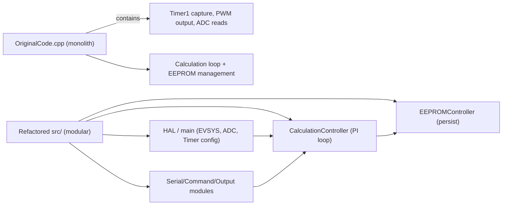

# Implementation Comparison — Original vs New

Scope
-----
This document compares the original GPSDO firmware implementation (`archive/OriginalCode.cpp`) with the refactored, ATmega4808-targeted implementation in `src/`. It highlights behavioural equivalence, architecture and implementation differences, assumptions made during porting, risks, and practical advice for validation.

Quick checklist (what this doc covers)
--------------------------------------
- [x] High-level behavioural summary of both implementations
- [x] Module-by-module comparison (what moved/changed)
- [x] Timers, capture, ADC, DAC, and Event System differences
- [x] EEPROM / persistence differences and layout mapping
- [x] ISR and concurrency changes
- [x] Testing and validation suggestions
- [x] Short mermaid diagrams that visualize the before/after architecture

High-level behaviour (both implementations)
-------------------------------------------
- Goal: discipline a local oscillator (VCO/OCXO/VCXO) using GPS 1PPS as a timing reference.
- Measure a fast pulse train (5 MHz) and a slower phase/tic analog input (TIC) on PPS events.
- Compute a PI-style control correction and apply a 16-bit DAC output to steer the oscillator.
- Maintain long-term statistics (300 s buckets and 3 h averages) and persist them to EEPROM for diagnostics/history and warm restart behaviour.

Files compared
--------------
- Original implementation (monolith): `archive/OriginalCode.cpp` (Arduino-UNO / ATmega328P assumptions, direct use of Timer1 input capture and PWM-based 16-bit DAC via two 8-bit PWM pins).
- New implementation (modular): `src/main.cpp`, `src/CalculationController.*`, `src/EEPROMController.*`, `src/SerialOutputController.*`, `src/CommandProcessor.*`, `src/Callbacks.h` (ATmega4808-targeted: TCA/TCB timers, EVSYS routing, external I2C DAC interface). `src/Constants.h` centralises numeric and pin constants.

Mermaid: before / after architecture
-----------------------------------

Major implementation differences
--------------------------------
1) Structure & modularity
- Original: large single-file implementation with globals for virtually all runtime state and direct EEPROM writes intermixed with control logic.
- New: separated into modules with clear responsibilities: `CalculationController` (control math and state), `EEPROMController` (persist/load), `main.cpp` and HAL wiring (peripheral setup and ISRs), `CommandProcessor` and `SerialOutputController` for I/O.

Why it matters
- Smaller modules are easier to review, validate on hardware, and port to a new MCU. Side effects and I/O are isolated.
- The control algorithm is easier to reason about and the persistent layout is explicit and checked by a magic number.

2) Timers, capture, and EVSYS
- Original (ATmega328P): uses Timer1 input capture (ICR1), manually configured modulo 50000 counting, and PWM on two 8-bit pins to create a 16-bit DAC.
- New (ATmega4808): uses Event System (EVSYS) to route PA5 5MHz pulses to `TCA0` as an event-driven counter and PA4 to `TCB0` capture for PPS; ADC is triggered by EVSYS (ADC0 start on channel). Uses an external I2C DAC (`DAC8571`) instead of PWM-based DAC.

Implications
- EVSYS reduces software jitter and ISR workload because peripherals trigger each other in hardware.
- Replacing PWM DAC with I2C DAC changes timing and resolution/latency characteristics; the controller accounts for a 16-bit DAC range but now uses the external DAC API (I2C) via `DAC8571` library.

3) ADC / TIC capture
- Original: `analogRead(A0)` inside the capture ISR (Timer1 capture). ADC usage was interleaved and used dummy reads to avoid channel bleed.
- New: ADC conversion result is read in `ADC0_RESRDY_vect` ISR (event-triggered by PPS via EVSYS). ISR keeps work minimal (reads `ADC0.RES` and sets `adcReady`) and main snapshot uses `ATOMIC_BLOCK` to capture shared state.

Behavioral differences and rationale
- Moving ADC reading out of the capture ISR and using hardware-triggered ADC with separate ISR reduces ISR latency for the PPS capture and better isolates ADC timing.
- The original did some ADC dummy reads to avoid channel interference; the new implementation relies on EVSYS and ADC configuration to reduce cross-influence. Verify ADC channel ordering and sampling settling for your hardware.

4) ISR design and concurrency
- Original: several places call `analogRead()` inside ISRs; many globals mutated directly. The code is tightly coupled with hardware timings.
- New: ISRs are minimal and only snapshot hardware counters or set flags. All heavier calculations are in `CalculationController::calculate()` executed in the main loop context.

Advantages
- Less time spent in ISRs reduces missed events and makes priority adjustments safer. `ATOMIC_BLOCK` is used to snapshot multi-byte shared values safely.

5) EEPROM and persistence
- Original: ad-hoc EEPROM writes with specific offsets (e.g. storing restarts at 991/992 and many small writes into large offsets tied to j & k variables). Long-term storage logic is in the monolith.
- New: `EEPROMController::PersistedState` defines a packed struct with named fields. A 4-byte magic (`0x47505344`) guards validity. The struct is written via `EEPROM.update()` and magic written last.

Implications
- The new approach is safer (atomic-like check via magic) and clearer: fields, sizes, and ordering are explicit and documented in `docs/eeprom-layout.md`.
- The legacy layout stored many 3-hour blocks across scattered offsets and used 2-byte writes; the new firmware stores only summarized long-term averages and a handful of counters, reducing EEPROM churn and simplifying layout.

6) DAC output
- Original: 16-bit DAC emulated by two 8-bit PWM pins (`analogWrite` high and low bytes) with RC filtering to form analog voltage. This has timing and filtering characteristics and may rely on PWM frequency and filters.
- New: uses external DAC (`DAC8571` via I2C). This removes PWM filtering artefacts and provides more stable digital-to-analog conversion, but adds I2C communication latency.

Advice
- Verify that your DAC output loop timing still meets the control loop's expected responsiveness. I2C latency is typically milliseconds — acceptable for 1PPS-based control but verify transient behaviour (hold mode transitions, manual override) on hardware.

7) Control algorithm and numeric types
- The core PI-style algorithm, TIC linearization, and long-term aggregation logic remain conceptually the same (gain, damping, iTerm/pTerm, tic filtering, time constants) but the refactor uses typed structures (`ControlState`) and fixed-width integer types where appropriate.
- Small changes in floating-point vs integer rounding, ordering, or overflow handling are possible. The refactor kept variable names and scaling close to original to preserve behaviour.

Validation steps to ensure behaviour parity
------------------------------------------
1. Smoke tests (offline, fast):
   - Run static checks and compile for ATmega4808 (PlatformIO board config). Confirm no build errors.
   - Run the pin-define extractor (`tools/compare_pins.py`) and ensure `PPS_IN`, `TIC`, DAC, and other pins map to expected schematic pins.

2. Hardware functional tests:
   - Start with bench mode: connect a known stable 5 MHz source and a known TD (1PPS) input; validate that the measured pulse counts printed on serial match expectations (the `main.cpp` prints captured values on PPS events).
   - Confirm ADC/TIC readings are sensible and comparable to the legacy firmware for the same inputs.
   - Validate DAC output value range and that hold/run transitions behave as expected.

3. Long-run tests:
   - Leave device running for >= 3 hours to exercise long-term aggregation and persistence code path (the code triggers `saveState()` on 3-hour windows). Verify EEPROM contents match `docs/eeprom-layout.md` descriptions.
   - Power-cycle and confirm controller restores persisted DAC output and avoids large transients.

4. Cross-check telemetry vs legacy device:
   - If you have a device running original firmware, capture telemetry (TIC values, DAC outputs, lock status) under identical conditions and compare trends.

Known risks and mitigations
---------------------------
- ADC channel mapping and sampling: the 4808 ADC mux and VREF configuration are different from the 328P. Verify that `ADC0.MUXPOS = ADC_MUXPOS_AIN0_gc` picks the same physical pin and that the input is stable when sampled. Mitigation: add a short settling delay or sample multiple times during development.
- DAC latency: I2C-connected DACs introduce bus latency; ensure you don't call the DAC excessively from ISRs. Current design calls DAC from controller main context via callback `setDacValue` which uses the `dac.write()` call.
- Persistence incompatibility: The new `kMagic` guards against accidental loading of legacy EEPROM images. If you need to preserve legacy EEPROM content, write a small migration utility that reads the old layout and translates it into the new `PersistedState` fields.
- Timer/counter scaling: TCA/TCC/TCB counters and prescalers may have different behaviour. Validate that modulo periods and overflow counting produce the same timebase.

Practical recommendations and next steps
---------------------------------------
- Document deterministic sample traces for `CalculationController` logic: produce a few canonical input traces (timer/tic sequences) and expected outcomes so manual or scripted verification is straightforward during refactors.
- Create a migration tool (small sketch or PC utility) to read old EEPROM format and populate the new format if you need continuity of historical data.
- Add a short `docs/verification-plan.md` with explicit commands and expected serial outputs for each smoke test.
- Consider adding small integration checks that run on the host comparing deterministic sample traces to actual controller outputs in a scripted way.

Appendix: matching key variables
-------------------------------
The following table maps important runtime variables/fields from the original monolith to the refactored structures:

- Original `I_term`, `P_term`, `I_term_long`, `I_term_remain` -> `ControlState::iTerm`, `ControlState::pTerm`, `ControlState::iTermLong`, `ControlState::iTermRemain`.
- Original `dacValue`, `dacValueOut`, `holdValue` -> `ControlState::dacValue`, `ControlState::dacValueOut`, `ControlState::holdValue`.
- Original `timeConst`, `filterDiv`, `filterConst`, `ticOffset` -> `ControlState::timeConst`, `ControlState::filterDiv`, `ControlState::filterConst`, `ControlState::ticOffset`.
- Original `tempCoeff`, `tempRef` -> `ControlState::tempCoefficientC`, `ControlState::tempReferenceC`.
- Original `TIC_ValueFiltered` -> `ControlState::ticValueFiltered` (persisted).
- Original long-term `StoreTIC_A[]`, `StoreTempA[]`, `StoreDAC_A[]`, `sum*` variables -> `LongTermControlState` counters and averaged fields `ticAverage3h`, `tempAverage3h`, `dacAverage3h`.

Closing notes
-------------
The refactor preserves the original GPSDO behaviour but packages the logic into clearer modules, improves ISR discipline, and adapts hardware-specific wiring to the ATmega4808 (EVSYS, TCA/TCB, ADC0). The most important validation is hardware testing under representative conditions (5 MHz input, PPS, OCXO) and verifying that observed DAC outputs and lock behaviour match expectations. If you want, I can:

- Produce a `docs/verification-plan.md` with exact serial commands and expected outputs to step through smoke tests.
- Write a small EEPROM migration script to convert legacy EEPROM layouts to the new `PersistedState`.
